# Ingeniux CMS MCP Server - System Architecture

## 1. System Overview

The Ingeniux CMS MCP Server provides programmatic access to Ingeniux CMS WebAPI v10.6.378 through the Model Context Protocol (MCP), enabling AI assistants to interact with CMS content and operations via OAuth-authenticated API calls.

### 1.1 High-Level Architecture

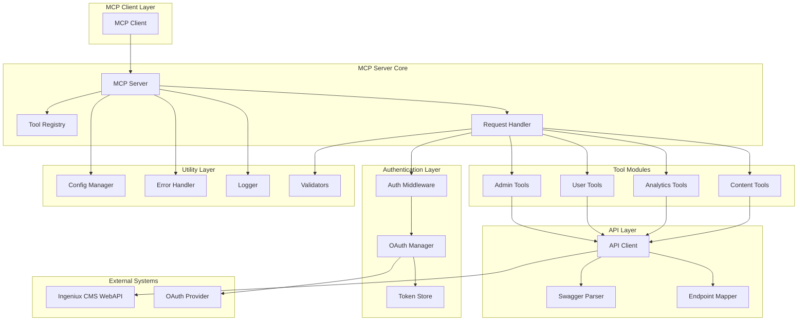

## 2. Component Architecture

### 2.1 Module Structure

```
src/
├── core/                    # Core MCP server functionality
│   ├── mcp-server.ts       # Main MCP server implementation
│   ├── tool-registry.ts    # Tool registration and management
│   └── request-handler.ts  # Request processing pipeline
├── auth/                   # Authentication and authorization
│   ├── oauth-manager.ts    # OAuth flow implementation
│   ├── token-store.ts      # Secure token storage
│   └── auth-middleware.ts  # Authentication middleware
├── api/                    # API integration layer
│   ├── swagger-parser.ts   # Swagger specification parser
│   ├── endpoint-mapper.ts  # API endpoint categorization
│   └── api-client.ts       # HTTP client for CMS API
├── tools/                  # MCP tool implementations
│   ├── content-tools.ts    # Content management tools
│   ├── analytics-tools.ts  # Analytics and reporting tools
│   ├── user-tools.ts       # User management tools
│   └── admin-tools.ts      # System administration tools
├── utils/                  # Shared utilities
│   ├── config-manager.ts   # Configuration management
│   ├── error-handler.ts    # Error handling and formatting
│   ├── logger.ts           # Structured logging
│   └── validators.ts       # Input validation utilities
└── types/                  # TypeScript type definitions
    ├── api-types.ts        # API-related types
    ├── mcp-types.ts        # MCP protocol types
    └── config-types.ts     # Configuration types
```

### 2.2 Core Components

#### 2.2.1 MCP Server Core

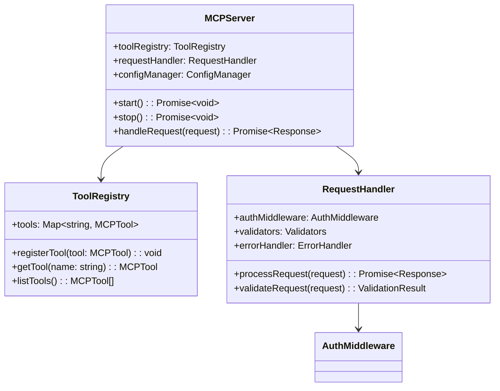

#### 2.2.2 Authentication Layer

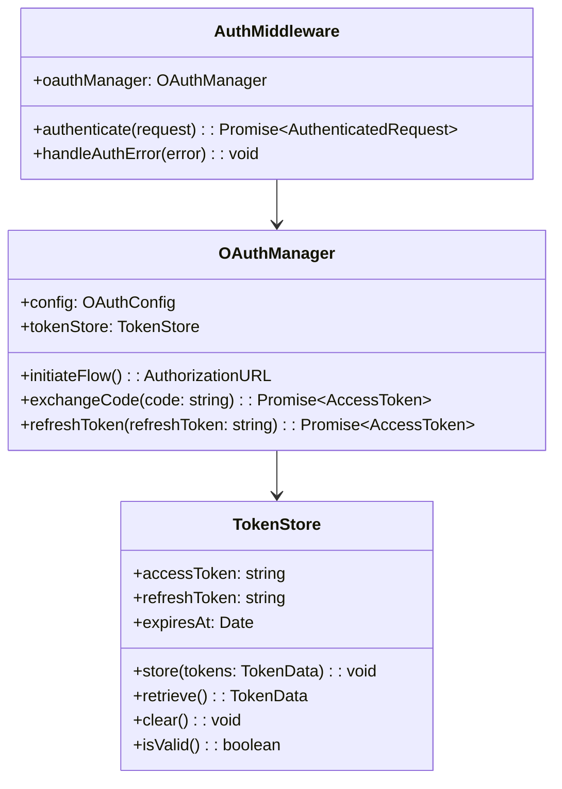

### 2.3 Data Flow Architecture

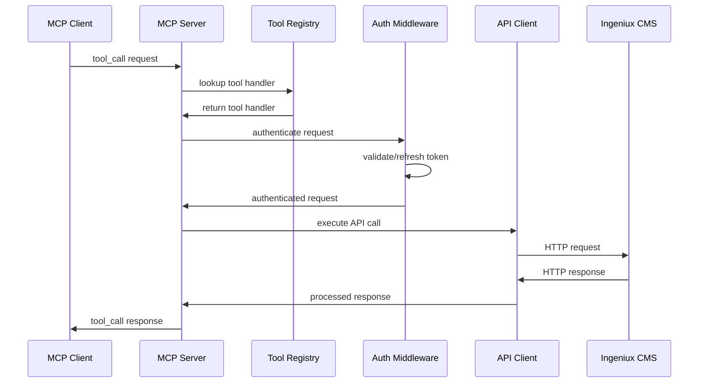

## 3. Security Architecture

### 3.1 OAuth Implementation Design

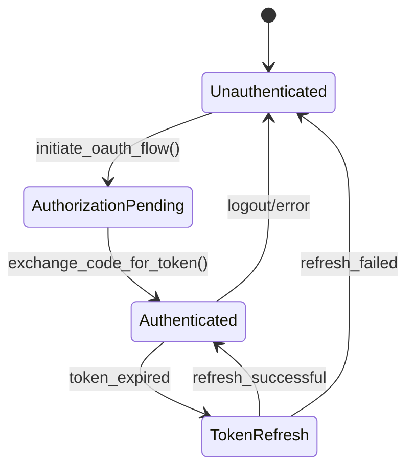

#### 3.1.1 OAuth Flow Components

- **Authorization URL Generation**: PKCE-enabled with state validation
- **Token Exchange**: Secure code-to-token exchange with validation
- **Token Management**: Encrypted storage with automatic refresh
- **Error Handling**: Graceful degradation with re-authentication triggers

### 3.2 Security Middleware Stack

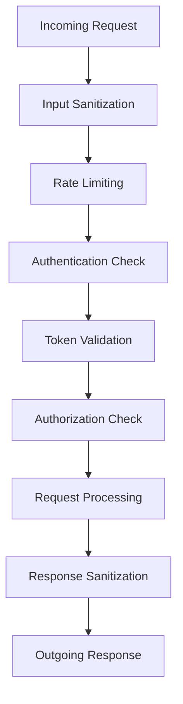

### 3.3 Token Security Design

- **Storage**: Environment-based configuration only
- **Encryption**: AES-256 encryption for token persistence
- **Rotation**: Automatic token refresh before expiration
- **Cleanup**: Secure token clearing on shutdown/error

## 4. Plugin Architecture

### 4.1 Extensible Tool System

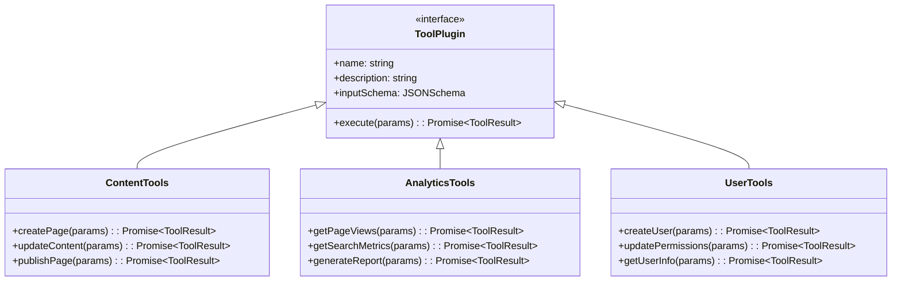

### 4.2 Endpoint Mapping Strategy

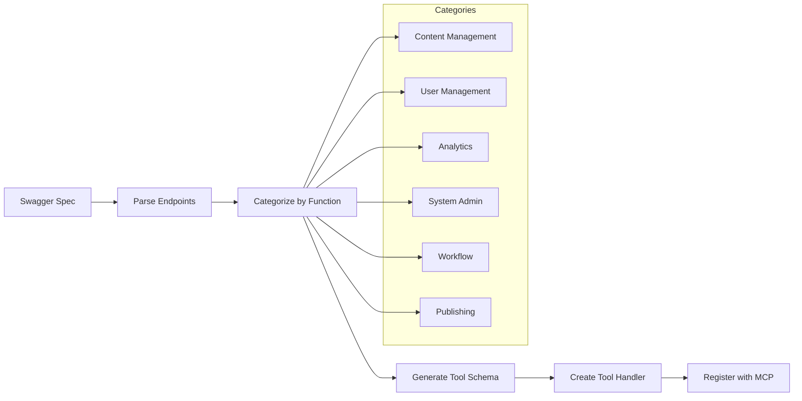

## 5. Configuration Architecture

### 5.1 Environment-Based Configuration

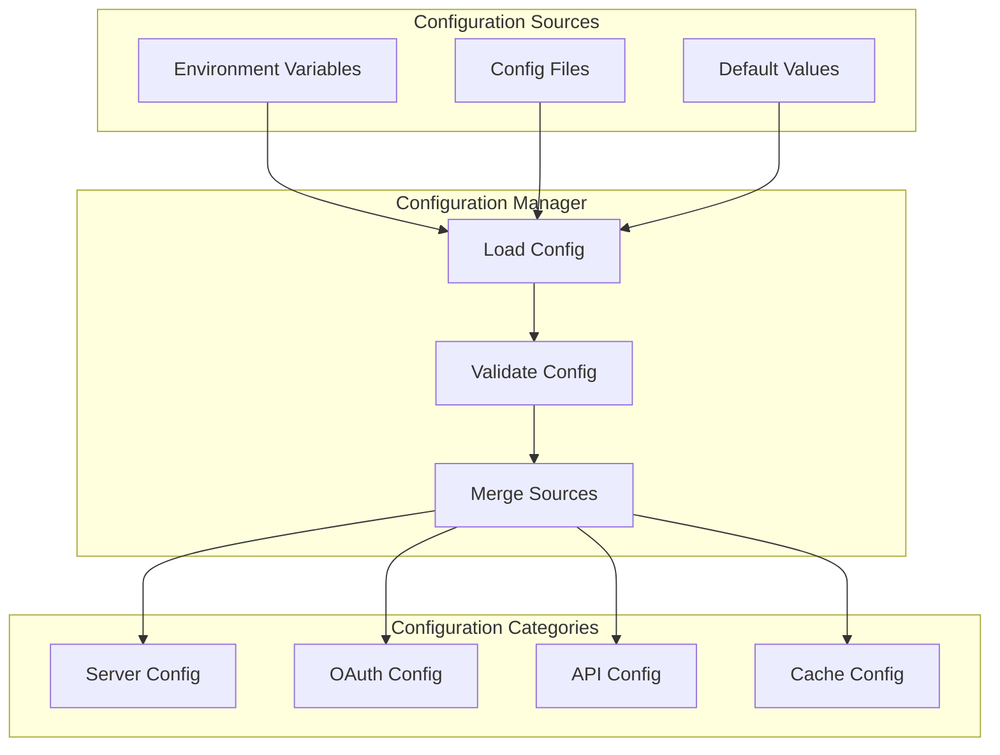

### 5.2 Configuration Schema

```typescript
interface ServerConfig {
	// Server settings
	port: number;
	host: string;
	
	// CMS connection
	cmsBaseUrl: string;
	apiTimeout: number;
	maxRetries: number;
	
	// OAuth configuration
	oauth: {
		clientId: string;        // from ENV only
		clientSecret: string;    // from ENV only
		authorizationUrl: string;
		tokenUrl: string;
		redirectUri: string;
		scopes: string[];
	};
	
	// Performance settings
	cache: {
		ttl: number;
		maxSize: number;
		evictionPolicy: string;
	};
	
	// Logging configuration
	logging: {
		level: string;
		format: string;
		destination: string;
	};
}
```

## 6. Error Handling Architecture

### 6.1 Error Classification System

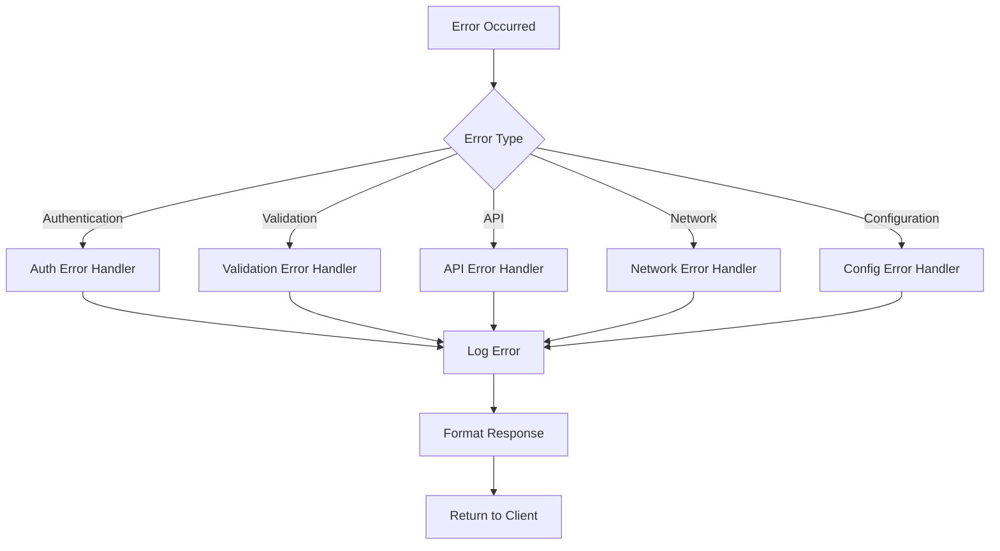

### 6.2 Error Recovery Strategies

- **Authentication Errors**: Trigger re-authentication flow
- **Network Errors**: Implement exponential backoff retry
- **Rate Limiting**: Queue requests with delay
- **Validation Errors**: Provide detailed field-level feedback

## 7. Performance Architecture

### 7.1 Caching Strategy

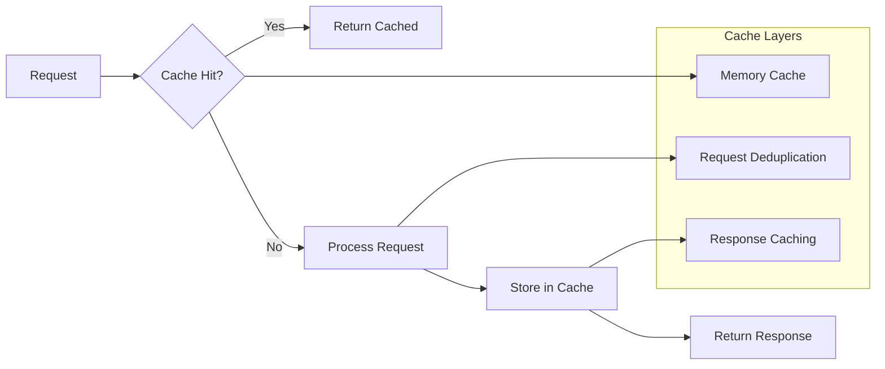

### 7.2 Rate Limiting Design

- **Sliding Window**: Prevents burst traffic abuse
- **Per-Client Limits**: Individual client rate tracking
- **Adaptive Throttling**: Dynamic adjustment based on load
- **Graceful Degradation**: Queue overflow handling

## 8. Deployment Architecture

### 8.1 Package Structure

```
dist/
├── index.js              # Entry point
├── core/                 # Core functionality
├── auth/                 # Authentication modules
├── api/                  # API integration
├── tools/                # Tool implementations
├── utils/                # Utilities
└── types/                # Type definitions

config/
├── default.json          # Default configuration
├── development.json      # Development overrides
└── production.json       # Production overrides

docs/
├── architecture.md       # This document
├── api-reference.md      # API documentation
└── deployment-guide.md   # Deployment instructions
```

### 8.2 Environment Configuration

```bash
# Required Environment Variables
CMS_BASE_URL=https://cms.example.com/api
OAUTH_CLIENT_ID=your_client_id
OAUTH_CLIENT_SECRET=your_client_secret
OAUTH_REDIRECT_URI=http://localhost:3000/callback

# Optional Environment Variables
API_TIMEOUT=30000
MAX_RETRIES=3
LOG_LEVEL=info
CACHE_TTL=300
RATE_LIMIT_RPM=100
```

### 8.3 Monitoring Integration Points

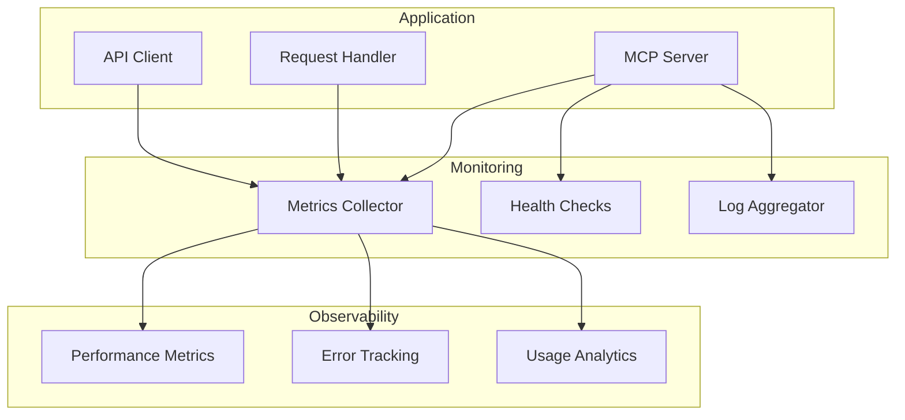

## 9. Scalability Considerations

### 9.1 Horizontal Scaling Design

- **Stateless Architecture**: No server-side session storage
- **External Token Storage**: Redis/database for token persistence
- **Load Balancer Ready**: Health check endpoints
- **Connection Pooling**: Efficient resource utilization

### 9.2 Performance Optimizations

- **Request Batching**: Combine similar API calls
- **Connection Reuse**: HTTP keep-alive and pooling
- **Lazy Loading**: On-demand tool registration
- **Memory Management**: Efficient garbage collection

## 10. Integration Points

### 10.1 MCP Protocol Compliance

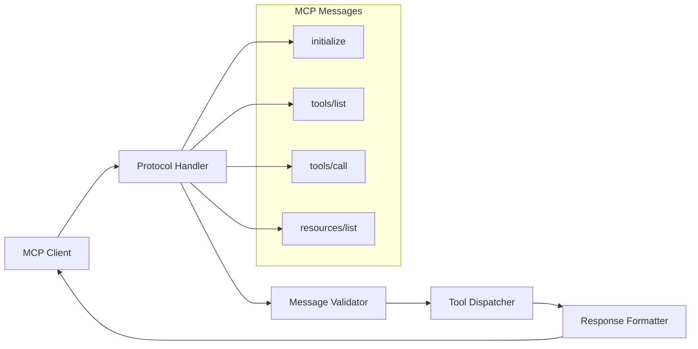

### 10.2 External System Dependencies

- **Ingeniux CMS WebAPI**: Primary data source
- **OAuth Provider**: Authentication service
- **Configuration Store**: Environment variables
- **Logging Service**: Structured log output
- **Monitoring System**: Metrics and health data

## 11. Design Rationale

### 11.1 Architectural Decisions

1. **Modular Design**: Each component <500 lines for maintainability
2. **Environment Configuration**: No hardcoded secrets or values
3. **Plugin Architecture**: Extensible tool system for future growth
4. **Security First**: OAuth with PKCE, encrypted token storage
5. **Error Resilience**: Comprehensive error handling and recovery

### 11.2 Technology Choices

- **TypeScript**: Type safety and developer experience
- **Node.js**: JavaScript ecosystem and MCP SDK compatibility
- **Modular Architecture**: Clean separation of concerns
- **Configuration-Driven**: Environment-based deployment flexibility

## 12. Future Extensibility

### 12.1 Plugin System Expansion

- Custom authentication providers
- Additional API version support
- Custom tool implementations
- Advanced caching strategies

### 12.2 Performance Enhancements

- Connection pooling optimization
- Intelligent request batching
- Predictive token refresh
- Adaptive rate limiting algorithms

---

**Document Version**: 1.0  
**Created**: 2025-01-06  
**Author**: System Architect  
**Status**: Architecture Design Complete