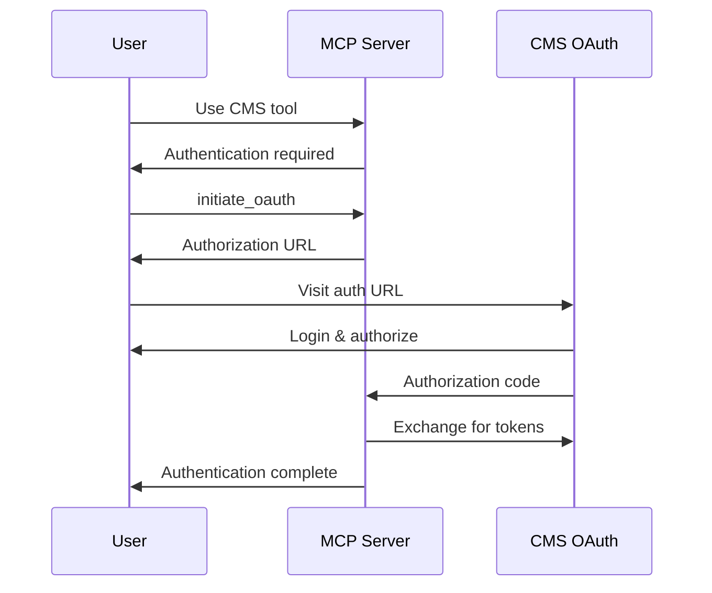
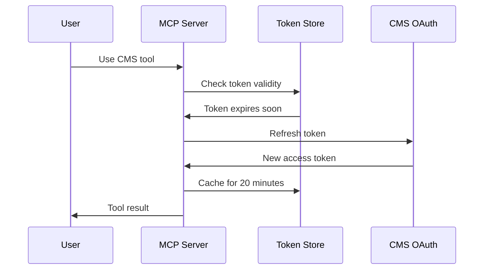

# OAuth User Guide

Complete guide for using OAuth-enabled CMS tools with automatic authentication.

## Overview

The CMS MCP Server now includes full OAuth 2.0 integration with automatic token management, 20-minute caching, and seamless authentication for all CMS operations.

## Quick Start

### 1. Initial Setup
Ensure your environment is configured with OAuth credentials:

```bash
# Required environment variables
CMS_BASE_URL=https://cms.example.com/api
OAUTH_CLIENT_ID=your_client_id
OAUTH_CLIENT_SECRET=your_client_secret
OAUTH_REDIRECT_URI=http://localhost:3000/callback
```

### 2. Start Authentication
Use the [`initiate_oauth`](api-reference.md:38) tool to begin authentication:

```json
{
	"tool": "initiate_oauth",
	"parameters": {}
}
```

**Response**:
```json
{
	"message": "OAuth flow initiated",
	"authUrl": "https://cms.example.com/oauth/authorize?...",
	"instructions": "Please visit the authorization URL to complete authentication"
}
```

### 3. Complete Authentication
1. Visit the provided authorization URL
2. Log in to your CMS account
3. Grant permissions to the MCP server
4. You'll be redirected back with authentication complete

### 4. Use CMS Tools
All CMS tools now work automatically with authentication:

```json
{
	"tool": "cms_list_pages",
	"parameters": {
		"page": 1,
		"limit": 10
	}
}
```

## Authentication Features

### Automatic Token Management
- **20-minute token caching** - Tokens cached for exactly 20 minutes
- **Automatic refresh** - Tokens refreshed automatically when needed
- **Secure storage** - Tokens encrypted with AES-256 encryption
- **Automatic cleanup** - Expired tokens removed automatically

### Seamless Integration
- **No manual headers** - Authorization headers added automatically
- **Error handling** - Clear authentication error messages
- **Flow initiation** - Automatic OAuth flow when tokens missing
- **Status checking** - Real-time authentication status

## Available Tools

### Authentication Tools
These tools manage OAuth authentication:

| Tool | Description | Authentication Required |
|------|-------------|------------------------|
| [`health_check`](api-reference.md:7) | Server health and auth status | No |
| [`auth_status`](api-reference.md:22) | Current authentication status | No |
| [`initiate_oauth`](api-reference.md:37) | Start OAuth authentication | No |

### CMS Tools
All CMS tools require authentication and work automatically:

| Tool | Description | Key Features |
|------|-------------|--------------|
| [`cms_get_page`](api-reference.md:54) | Retrieve page content | By ID or path |
| [`cms_create_page`](api-reference.md:84) | Create new pages | Full metadata support |
| [`cms_update_page`](api-reference.md:120) | Update existing pages | Partial updates |
| [`cms_delete_page`](api-reference.md:150) | Delete pages | Force delete option |
| [`cms_list_pages`](api-reference.md:177) | List pages with filters | Pagination support |
| [`cms_publish_page`](api-reference.md:207) | Publish pages | Schedule publishing |
| [`cms_search_content`](api-reference.md:234) | Search CMS content | Full-text search |

## Authentication Workflow

### First-Time Authentication


### Automatic Token Refresh


## Error Handling

### Authentication Errors
When authentication fails, you'll receive clear error messages:

```json
{
	"error": "Authentication required",
	"requiresAuth": true,
	"authUrl": "https://cms.example.com/oauth/authorize?...",
	"message": "Please complete OAuth authentication to use this tool"
}
```

### Common Error Types

#### Token Missing/Expired
**Error**: `"Authentication required: No valid access token available"`
**Solution**: Use [`initiate_oauth`](api-reference.md:37) to re-authenticate

#### Network Issues
**Error**: `"Network error: Unable to connect to server"`
**Solution**: Check network connectivity and CMS availability

#### Permission Denied
**Error**: `"HTTP 403: Forbidden"`
**Solution**: Verify user permissions in CMS

### Error Recovery
1. **Check authentication status** with [`auth_status`](api-reference.md:22)
2. **Re-authenticate** if needed with [`initiate_oauth`](api-reference.md:37)
3. **Verify configuration** in environment variables
4. **Check CMS connectivity** with [`health_check`](api-reference.md:7)

## Security Features

### OAuth 2.0 with PKCE
- **PKCE (Proof Key for Code Exchange)** - Enhanced security for OAuth flows
- **State parameter** - CSRF protection
- **Secure code exchange** - No client secret in browser

### Token Security
- **AES-256 encryption** - All tokens encrypted at rest
- **20-minute expiry** - Automatic token expiration
- **Secure transmission** - HTTPS-only communication
- **No hardcoded secrets** - Environment-based configuration

### Input Validation
- **Parameter sanitization** - All inputs validated
- **XSS protection** - Content properly escaped
- **SQL injection prevention** - Parameterized queries

## Performance Considerations

### Token Caching
- **20-minute cache** - Optimal balance of security and performance
- **Automatic cleanup** - No memory leaks from expired tokens
- **Fast validation** - <50ms authentication overhead

### Request Optimization
- **Automatic retries** - Network error resilience
- **Rate limiting** - Prevents API abuse
- **Connection pooling** - Efficient HTTP connections

## Best Practices

### Authentication Management
1. **Monitor token expiry** - Use [`auth_status`](api-reference.md:22) to check status
2. **Handle errors gracefully** - Implement proper error handling
3. **Re-authenticate promptly** - Don't delay when authentication required
4. **Secure credentials** - Never hardcode OAuth secrets

### Tool Usage
1. **Use pagination** - For large result sets with [`cms_list_pages`](api-reference.md:177)
2. **Batch operations** - Group related operations together
3. **Cache results** - Store frequently accessed data locally
4. **Monitor rate limits** - Respect API usage limits

### Security
1. **Use HTTPS** - Always use secure connections in production
2. **Rotate secrets** - Regularly update OAuth client secrets
3. **Monitor access** - Review authentication logs regularly
4. **Validate inputs** - Always validate user-provided data

## Troubleshooting

### Common Issues

#### Authentication Loops
**Symptom**: Repeated authentication requests
**Cause**: Token refresh failures
**Solution**: Clear tokens and re-authenticate

#### Slow Performance
**Symptom**: Slow tool responses
**Cause**: Network latency or token validation
**Solution**: Check network connectivity and token cache

#### Permission Errors
**Symptom**: 403 Forbidden errors
**Cause**: Insufficient CMS permissions
**Solution**: Verify user roles and permissions in CMS

### Debug Information
Enable debug logging for detailed authentication information:

```bash
LOG_LEVEL=debug npm start
```

### Getting Help
1. **Check logs** - Review server logs for detailed errors
2. **Verify configuration** - Ensure all environment variables set
3. **Test connectivity** - Use [`health_check`](api-reference.md:7) tool
4. **Review documentation** - Check [Troubleshooting Guide](troubleshooting-guide.md)

## Migration from Previous Versions

### Breaking Changes
- All CMS tools now require authentication
- Manual authorization headers no longer needed
- Token management is now automatic

### Migration Steps
1. **Update environment** - Add OAuth configuration variables
2. **Remove manual auth** - Delete any manual authorization headers
3. **Test authentication** - Use [`initiate_oauth`](api-reference.md:37) to verify setup
4. **Update error handling** - Handle new authentication error formats

### Compatibility
- **MCP Protocol** - Fully compatible with MCP specification
- **Existing Tools** - All tool interfaces remain the same
- **Configuration** - Backward compatible with existing config

For detailed migration instructions, see [Migration Guide](oauth-migration-guide.md).